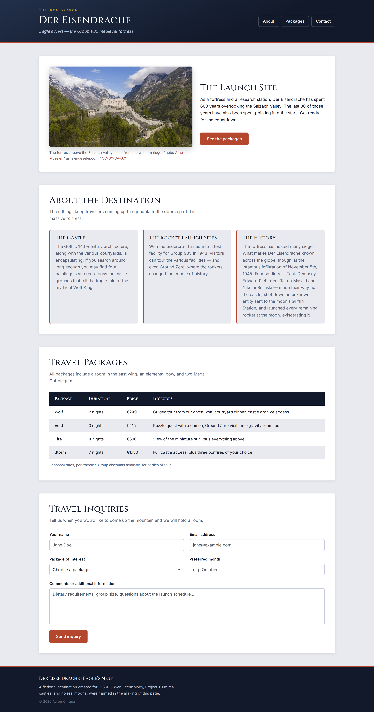
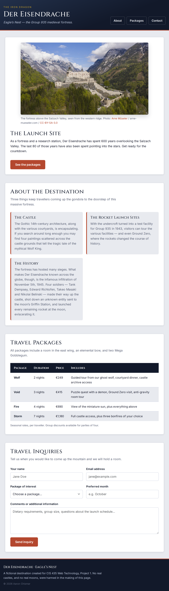
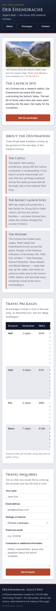

# Der Eisendrache — Travel Brochure

**CIS 435 Web Technology · Project 1**
Aaron Chismar · University of Michigan–Dearborn

A responsive, single-page travel brochure for a fictional destination: **Der Eisendrache**,
the Group 935 fortress at Eagle's Nest, from *Call of Duty: Black Ops III* Zombies.
Built with semantic HTML, Bootstrap 5, and a hand-written CSS layer using CSS variables,
CSS Grid, Flexbox, and media queries. **No JavaScript.**

**Live site:** https://aaronchismar.github.io/CIS435-Fall2026_AaronChismar/Project1/
&larr; [All CIS 435 projects](../README.md)

---

## Project structure

```
.
├── index.html
├── css/
│   ├── style.css                  # all custom styling
│   └── vendor/
│       ├── bootstrap.min.css      # Bootstrap 5.3.3, served from this repo
│       └── bootstrap.min.css.map  # source map for DevTools
├── img/
│   ├── hohenwerfen-800.jpg        # hero photo, four sizes for srcset
│   ├── hohenwerfen-1200.jpg
│   ├── hohenwerfen-1600.jpg
│   └── hohenwerfen-2400.jpg
├── screenshots/
│   ├── desktop-1440.png
│   ├── tablet-900.png
│   └── mobile-390.png
└── README.md
```

Bootstrap 5.3.3 is vendored into this repo rather than pulled from a CDN, so the page
renders identically offline and can't break if a CDN goes down. Google Fonts (Cinzel +
Inter) still load from Google. There are no build steps: open `index.html` and it works.

---

## Screenshots

Captured with Chrome DevTools device emulation (F12 → toggle device toolbar), full page.

### Desktop — 1440px

Two-column hero, three about-cards side by side, nav pushed right in the header.



### Tablet — 900px

Hero stacks, about-cards drop to two across, header stays on one line.



### Mobile — 390px

Single column throughout, nav wraps under the brand, form fields go full width, and the
packages table scrolls inside its own container so the page never scrolls sideways.



---

## Requirements checklist

### HTML

| Requirement | Where |
|---|---|
| Semantic elements | `<header>`, `<nav>`, `<main>`, `<section>`, `<article>`, `<figure>`, `<footer>` |
| Text input for name | `#visitor-name` |
| Email input | `#visitor-email` |
| Dropdown for packages | `#package-choice` — `<select>` with the four elemental bows |
| Text area for comments | `#visitor-comments` |
| Submit button | end of `#inquiry-form` |
| Table, 3+ columns / 2+ rows | `.package-table` — 4 columns, 4 data rows |
| At least one responsive image | `.hero-img` — `srcset` + `sizes` serve one of four widths depending on the device |
| Nav bar, internal links | `#main-nav` → `#about`, `#packages`, `#contact` |

### CSS

All of the following live in `css/style.css`.

| Requirement | Where |
|---|---|
| `--primary-color`, `--secondary-color`, `--text-color`, `--accent-color`, `--spacing` | `:root`, top of the file |
| Variables reused throughout | `var(--…)` appears 90+ times; `--spacing` is redefined inside the media queries so the whole page's rhythm tightens on smaller screens |
| CSS Grid: header / main / footer | `body { grid-template-areas: "header" "main" "footer" }` |
| Main divided into sections | `#site-main` is itself a grid, one row per section |
| Flexbox | `.nav-list`, `.header-inner`, `.inquiry-form` / `.form-row` / `.form-field` |
| Media query ≥ 1024px | "Large screens" block at the bottom |
| Media query 769–1023px | "Medium screens" block |
| Media query ≤ 768px | "Small screens" block |
| Tag selectors | `body`, `h2`, `a` |
| Class selectors | `.info-card`, `.nav-list`, `.package-table` |
| ID selectors | `#site-header`, `#site-main`, `#inquiry-form` |
| Pseudo-class selectors | `a:hover`, `:focus-visible`, `tr:nth-child(even)`, `tr:last-child` |
| Hover effects | Nav links, buttons, about-cards, table rows |
| Responsive image | `.hero-img` — `max-width: 100%`, `height: auto`, `object-fit: cover` |

---

## Note on one layout decision

A CSS Grid track's automatic minimum size is `min-content`, so a wide child can stretch
the track past the viewport. The packages table did exactly that, making the whole page
scroll sideways at 390px. Capping the tracks with `minmax(0, 1fr)` instead of `1fr` lets
the table scroll inside its own `.table-wrap` container while the page stays put.

---

## Credits

Hero photograph: Hohenwerfen Castle, Werfen, Austria.
Photo: **Arne Müseler** / [arne-mueseler.com](https://arne-mueseler.com) /
[CC-BY-SA-3.0](https://creativecommons.org/licenses/by-sa/3.0/) —
[original file on Wikimedia Commons](https://commons.wikimedia.org/wiki/File:Hohenwerfen_castle.jpg).
Resized and recompressed for the web; not otherwise modified.

*Call of Duty: Black Ops III*, Der Eisendrache, Group 935, and the characters named on
this page are trademarks of Activision. This is a non-commercial student coursework
project, not affiliated with or endorsed by Activision.
